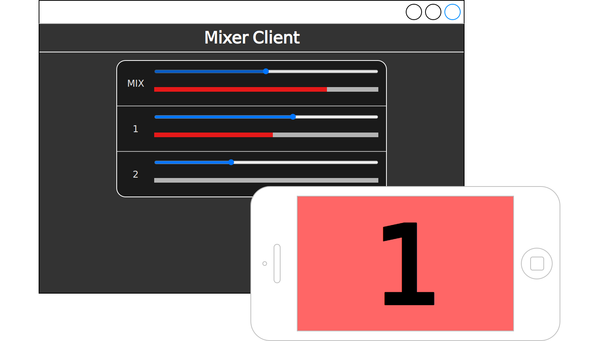
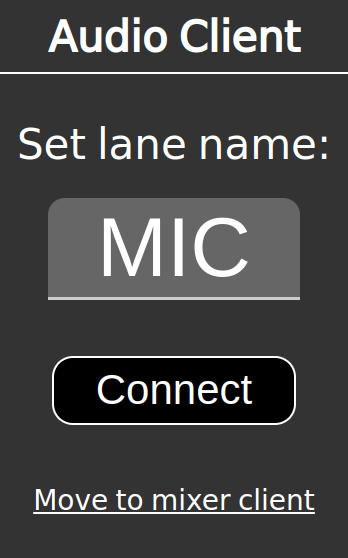
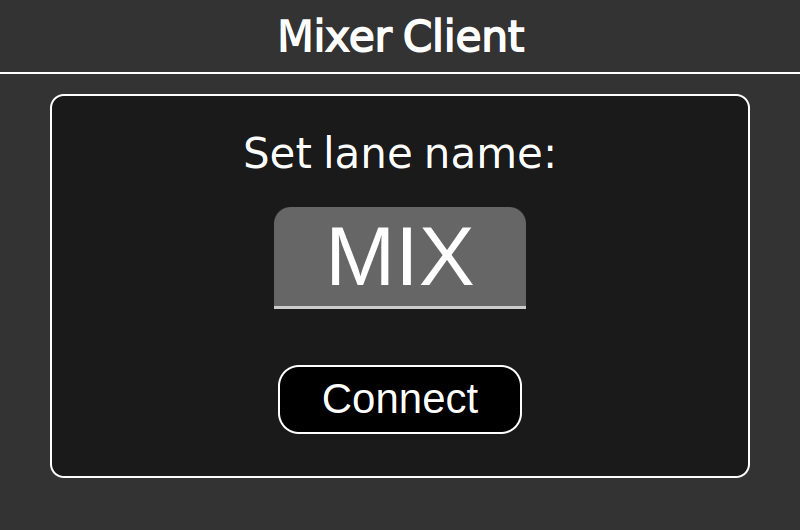
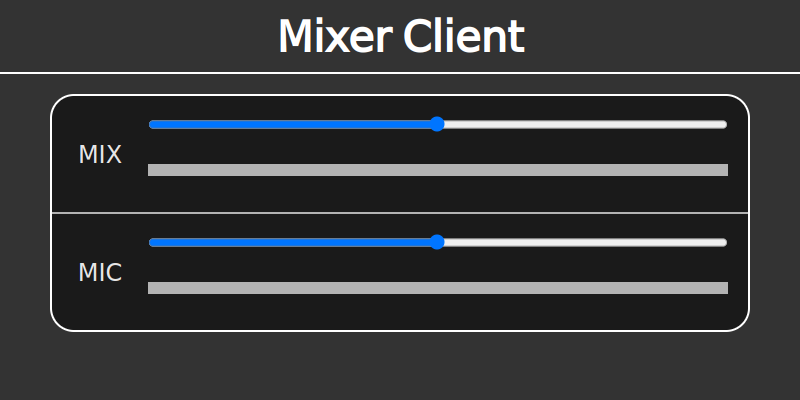

# web-intercom

[](https://github.com/aKuad/py-web-intercom/releases) [](https://github.com/aKuad/py-web-intercom/blob/main/LICENSE)

Inter-communication system on browser via LAN. Powered by Deno.



## Features

- Multi users talking
  - Required only a browser, additional applications isn't necessary
  - ... means this is cross-platform
- Each user's input volume controlling
  - Also works on browsers
- Easy to setup the server
  - Required only Deno

## Server deployment

As requirements, install [Deno](https://deno.com/) at first.

Then just only run:

```sh
cd src
deno run --allow-net --allow-read main.ts
```

## Client usage

### Audio client

Access to `http://server.address/`

Type lane name, then click 'connect'.



### Mixer client

Access to `http://server.address/mixer.html`

Type lane name, then click 'connect'.



Then view all lanes fader and meter. Move fader to control gain of each lane.



## License

[CC0-1.0](https://github.com/aKuad/py-web-intercom/blob/main/LICENSE)
