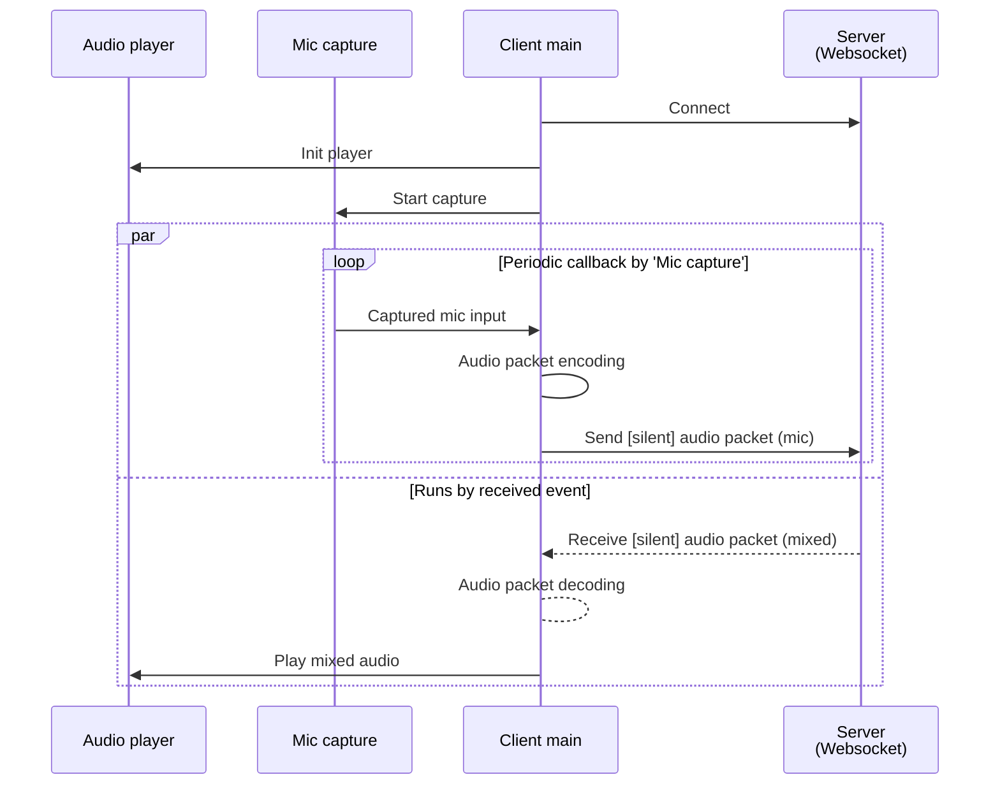

# Audio client sequence

> [!NOTE]
>
> It suppose implementation of JavaScript.
>
> At Python (with `sounddevice` and `websockets` module), it takes a little different sequence. But almost of all is same.
