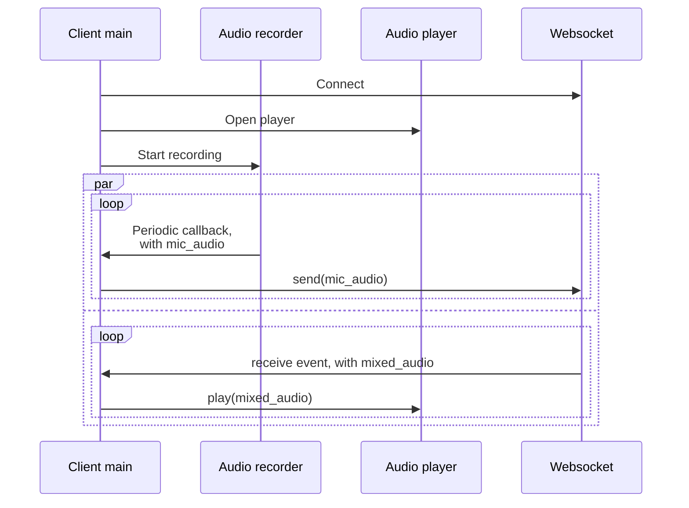

# Client sequence (JavaScript)

```mermaid
sequenceDiagram
  participant M as Client main
  participant R as Audio recorder
  participant P as Audio player
  participant W as Websocket

  M->>W: Connect
  M->>P: Open player
  M->>R: Start recording

  par
    loop
      R->>M: Periodic callback,<br>with mic_audio
      M->>W: send(mic_audio)
    end
  and
    loop
      W->>M: receive event, with mixed_audio
      M->>P: play(mixed_audio)
    END
  end
```
