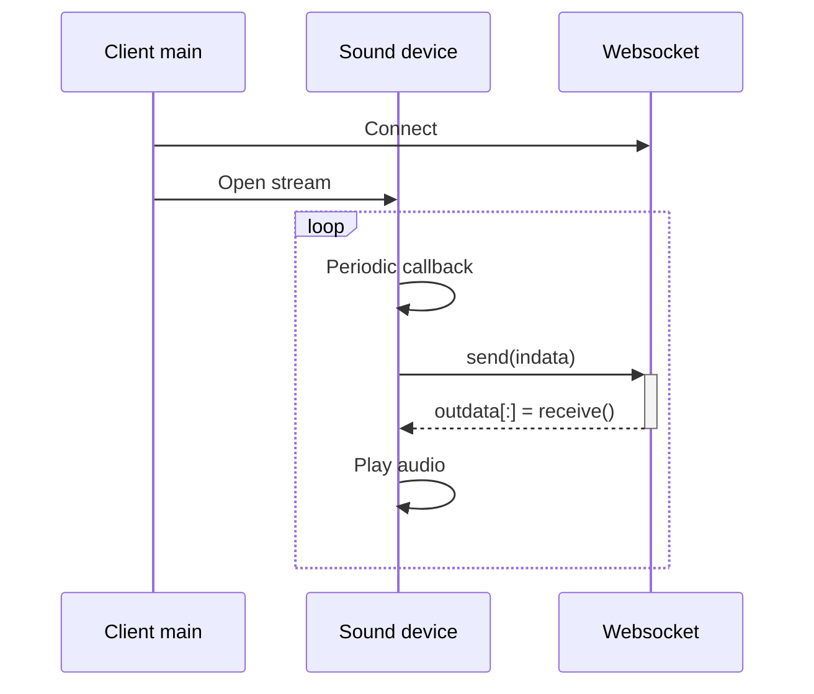

# Client sequence (Python)

```mermaid
sequenceDiagram
  participant M as Client main
  participant D as Sound device
  participant W as Websocket

  M->>W: Connect
  M->>D: Open stream

  loop
    D->>D: Periodic callback
    D->>+W: send(indata)
    W-->>-D: outdata[:] = receive()
    D->>D: Play audio
  end
```
