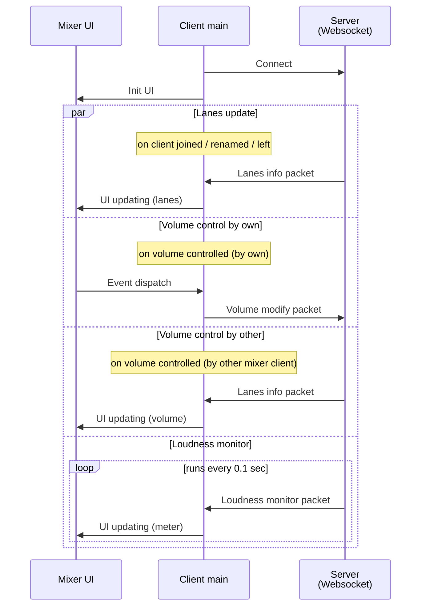

# Mixer client sequence

```mermaid
sequenceDiagram
  participant MU as Mixer UI
  participant CM as Client main
  participant WSS as Server<br>(Websocket)

  CM->>WSS: Connect
  CM->>MU: Init UI

  par Lanes update
    Note over CM: on client joined / renamed / left
    WSS->>CM: Lanes info packet
    CM->>MU: UI updating (lanes)
  and Volume control by own
    Note over CM: on volume controlled (by own)
    MU->>CM: Event dispatch
    CM->>WSS: Volume modify packet
  and Volume control by other
    Note over CM: on volume controlled (by other mixer client)
    WSS->>CM: Lanes info packet
    CM->>MU: UI updating (volume)
  and Loudness monitor
    loop runs every 0.1 sec
      WSS->>CM: Loudness monitor packet
      CM->>MU: UI updating (meter)
    end
  end
```

> [!NOTE]
>
> Audio client also runs in parallel. It for mixer monitor.
