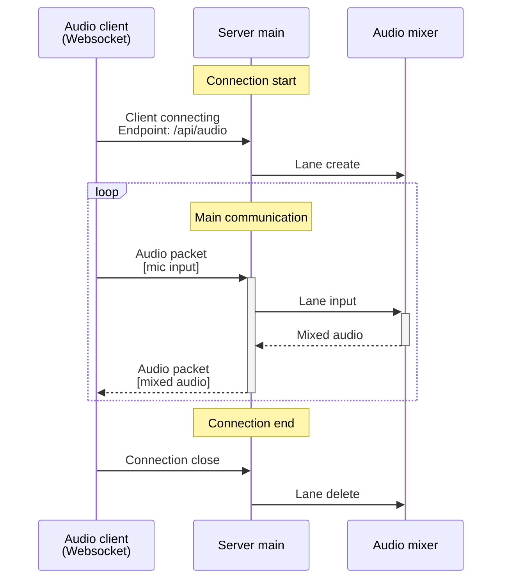
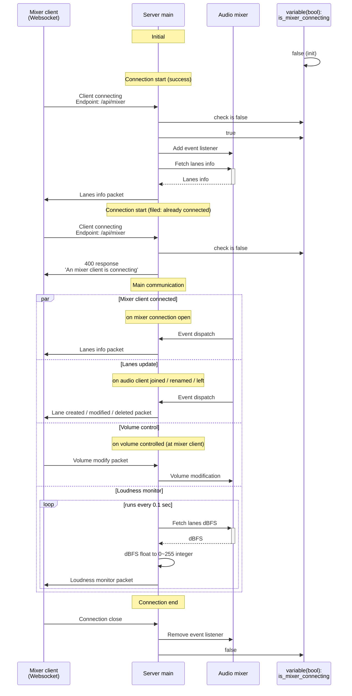

# Server sequence

## Audio communication

```mermaid
sequenceDiagram
  participant WSA as Audio client<br>(Websocket)
  participant S as Server main
  participant AM as Audio mixer

  Note over S: Connection start
  WSA->>S: Client connecting<br>Endpoint: /api/audio
  S->>AM: Lane create

  loop
    Note over S: Main communication
    WSA->>+S: Audio packet<br>[mic input]
    S->>+AM: Lane input
    AM-->>-S: Mixed audio
    S-->>-WSA: Audio packet<br>[mixed audio]
  end

  Note over S: Connection end
  WSA->>S: Connection close
  S->>AM: Lane delete
```

## Mixer control

```mermaid
sequenceDiagram
  participant WSM as Mixer client<br>(Websocket)
  participant S as Server main
  participant AM as Audio mixer
  participant VC as variable(bool):<br>is_mixer_connecting

  Note over S: Initial
  VC->>VC: false (init)

  Note over S: Connection start (success)
  WSM->>S: Client connecting<br>Endpoint: /api/mixer
  S->>VC: check is false
  S->>VC: true
  S->>AM: Add event listener
  S->>+AM: Fetch lanes info
  AM-->>-S: Lanes info
  S->>WSM: Lanes info packet

  Note over S: Connection start (filed: already connected)
  WSM->>S: Client connecting<br>Endpoint: /api/mixer
  S->>VC: check is false
  S->>WSM: 400 response<br>'An mixer client is connecting'

  Note over S: Main communication
  par Mixer client connected
    Note over S: on mixer connection open
    AM->>S: Event dispatch
    S->>WSM: Lanes info packet
  and Lanes update
    Note over S: on audio client joined / renamed / left
    AM->>S: Event dispatch
    S->>WSM: Lane created / modified / deleted packet
  and Volume control
    Note over S: on volume controlled (at mixer client)
    WSM->>S: Volume modify packet
    S->>AM: Volume modification
  and Loudness monitor
    loop runs every 0.1 sec
      S->>+AM: Fetch lanes dBFS
      AM-->>-S: dBFS
      S->>S: dBFS float to 0~255 integer
      S->>WSM: Loudness monitor packet
    end
  end

  Note over S: Connection end
  WSM->>S: Connection close
  S->>AM: Remove event listener
  S->>VC: false
```
