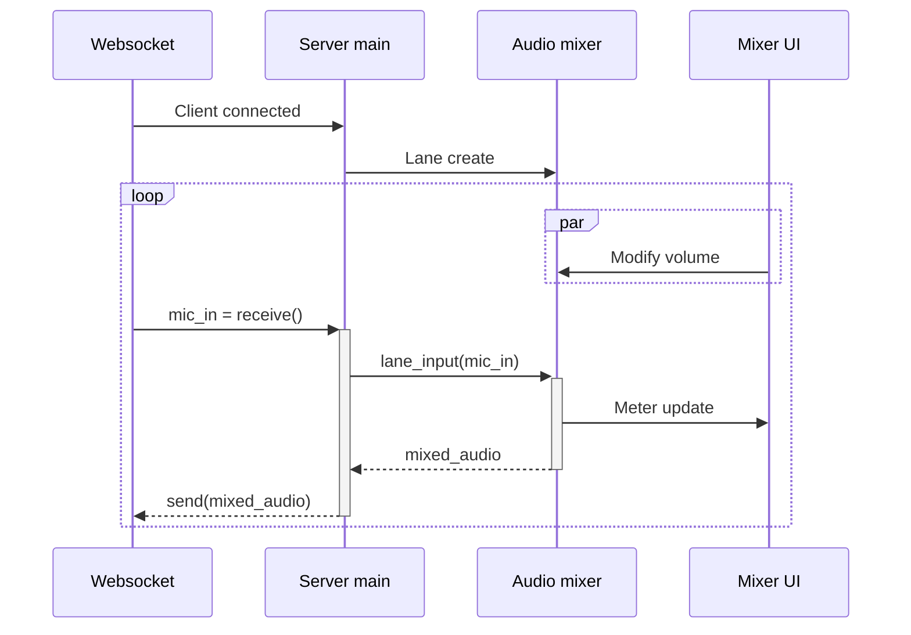

# Server sequence

```mermaid
sequenceDiagram
  participant W as Websocket
  participant S as Server main
  participant AM as Audio mixer
  participant MU as Mixer UI

  W->>S: Client connected
  S->>AM: Lane create

  loop
    par
      MU ->> AM: Modify volume
    end

    W->>+S: mic_in = receive()
    S->>+AM: lane_input(mic_in)
    AM->>MU: Meter update
    AM-->>-S: mixed_audio
    S-->>-W: send(mixed_audio)
  end
```
